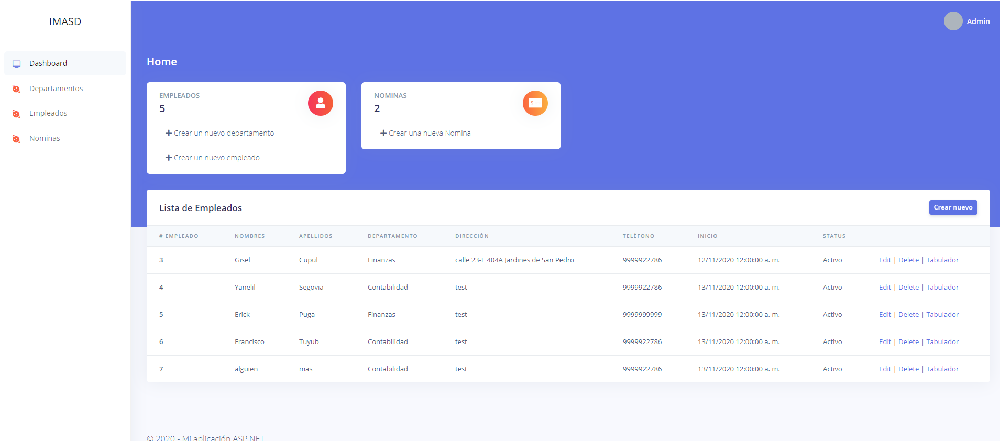
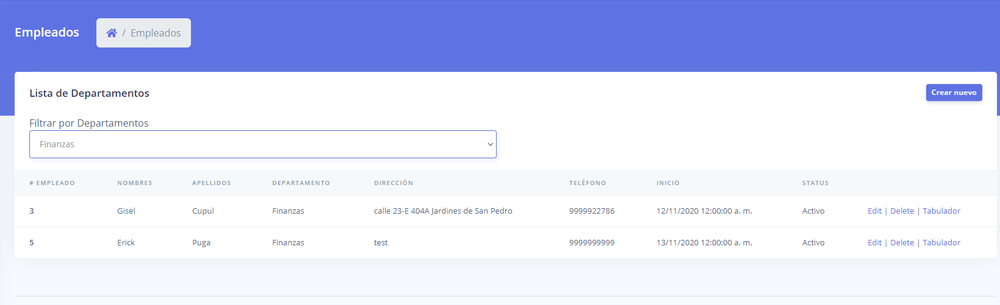
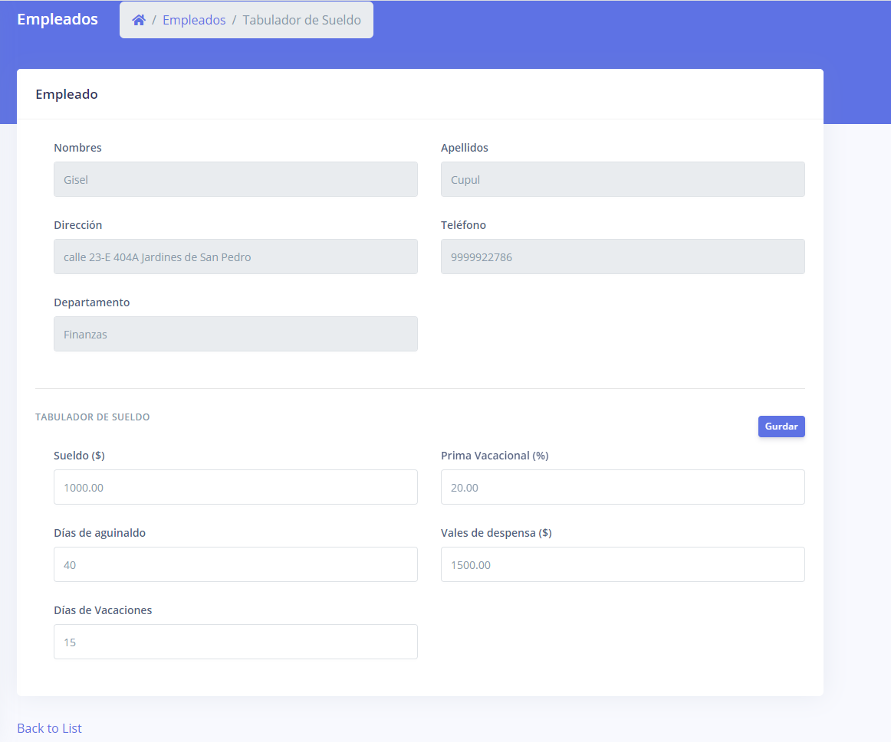
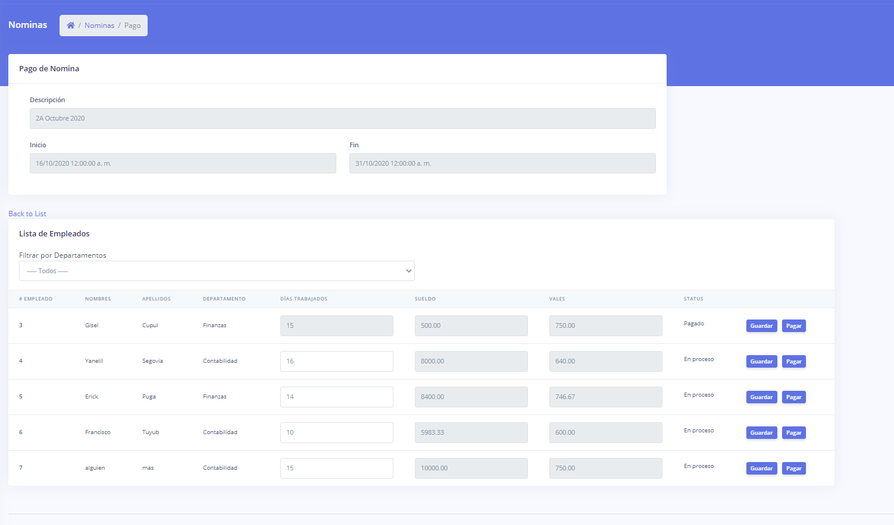

# IMASD

[Script DB](IMASD/IMASD.sql)

Para entrar hay un pequeño login

**Usuario:** admin

**password:** admin123

**PROCESO**

1. Crear un departamento
2. Dar de alta un empleado
3. En el listado del empleado, hay una opción de tabulador por empleado.

4. Dar de alta una nomina (1A Noviembre 2020 1/11/2020 - 15/11/2020)
5. Cada nomina despues de crearla tiene una opción para el proceso de pago

6. En el proceso de pago se modifica los dias trabajados de cada empleado en el periodo de la nomina ya seleccionado y hace el calculo para el sueldo y los vales.

7. **Guardar** solo guarda la información
8. **Pagar** hace el proceso de pago y deshabilita los dias para que no se puedan modificar.
